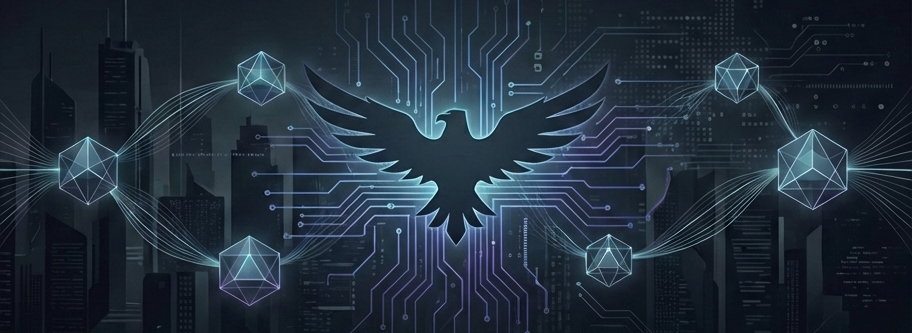
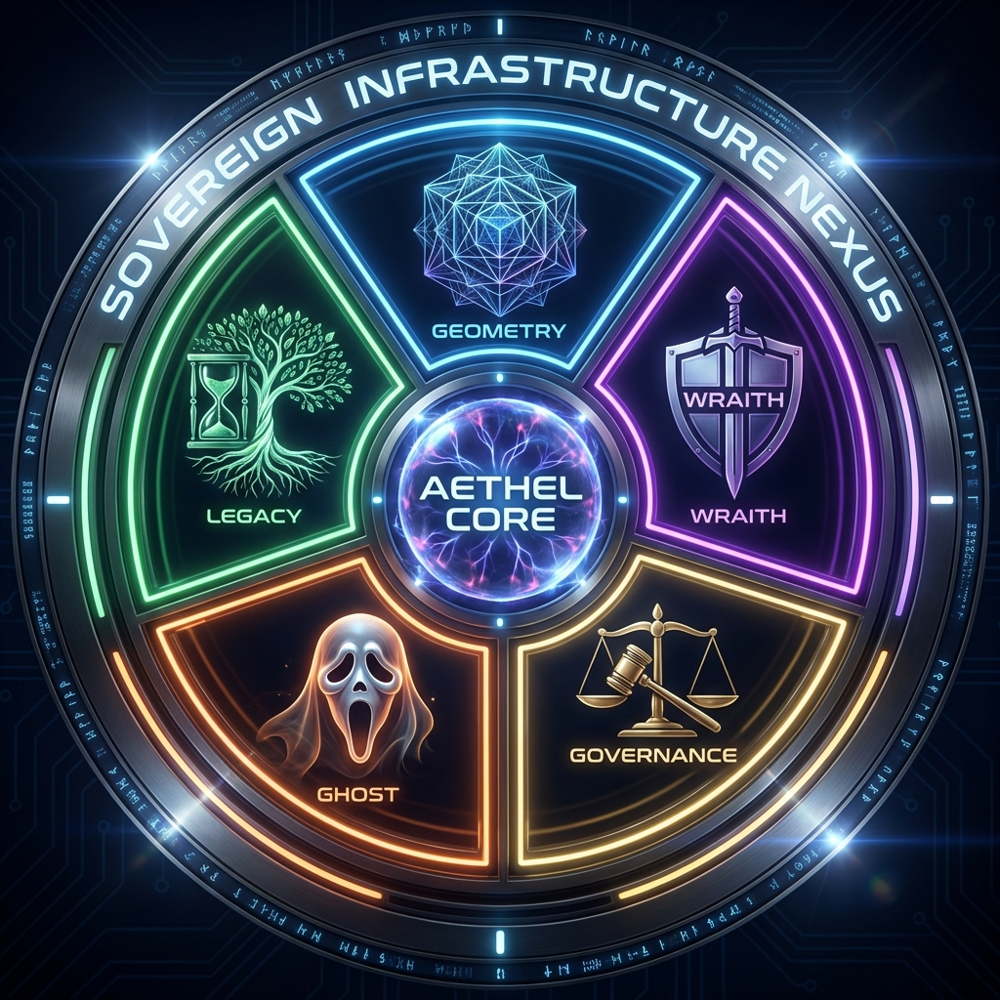

# ÆTHEL Foundation
### Sovereign Infrastructure Nexus

A **AETHEL Foundation** é um ecossistema de infraestrutura soberana dedicado à inteligência artificial autônoma, segurança proativa e resiliência digital. 

Nossa missão é fornecer os blocos de construção essenciais para que sistemas digitais operem com independência, integridade e invisibilidade tática em ambientes adversos.

## 🌌 O Nexus de Módulos

As tecnologias da fundação são distribuídas em cinco motores especializados, operando em uníssono ou de forma independente:

  

### 🧬 [Æ-Pattern-Geometry](https://github.com/aethel-fundation/ae-pattern-geometry)
**Deep Signal Analysis & Time-Series Recognition**
Motor matemático agnóstico para detecção de fractais e padrões em fluxos de dados dinâmicos (IoT, Bio-sinais, Mercados).
`#geometry` `#math` `#time-series`

### 🦅 [Æ-Wraith-Engine](https://github.com/aethel-fundation/ae-wraith-engine)
**Adversarial AI Detection & Active Defense**
Inteligência ofensiva para identificação de agentes não-humanos, proteção contra DDoS de camada 7 e mitigação de botnets.
`#cybersecurity` `#threat-intelligence` `#anti-bot`

### ⚖️ [Æ-Governance-Guard](https://github.com/aethel-fundation/ae-governance-guard)
**Constitutional AI & Autonomous Compliance**
Framework de enforcamento de leis e guardrails táticos, garantindo que IAs operem sob limites éticos e operacionais rígidos.
`#ai-governance` `#ai-safety` `#compliance`

### 👻 [AE--Ghost-Protocol](https://github.com/aethel-fundation/ae--ghost-protocol)
**Behavioral Obfuscation & Privacy Engineering**
Protocolo de ofuscação de tráfego e mimetismo de dados para garantir o anonimato de intenções e a segurança de metadados.
`#privacy` `#stealth` `#obfuscation`

### 🛡️ [AE-Legacy-Strategy](https://github.com/aethel-fundation/ae-legacy-strategy)
**Infrastructure Resilience & Digital Survival**
Mecanismos de Dead Man's Switch, failover geopolítico e recuperação de desastres para ativos digitais críticos.
`#resilience` `#dms` `#high-availability`

---
> *"A fundação da soberania digital começa com a independência da infraestrutura."*
🦅🔗✨
